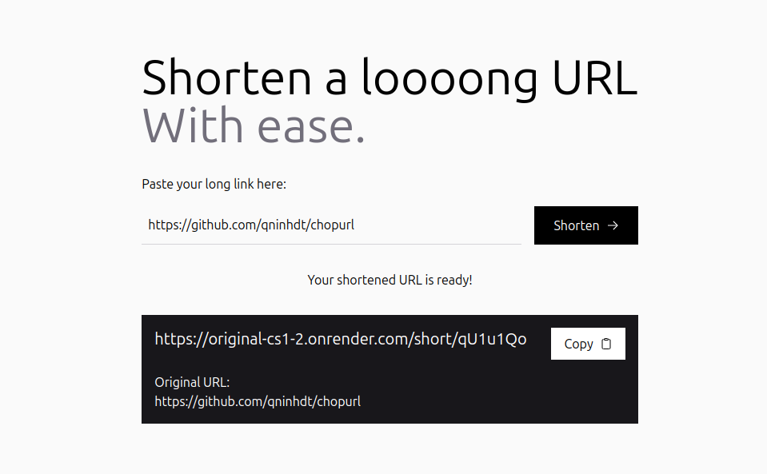
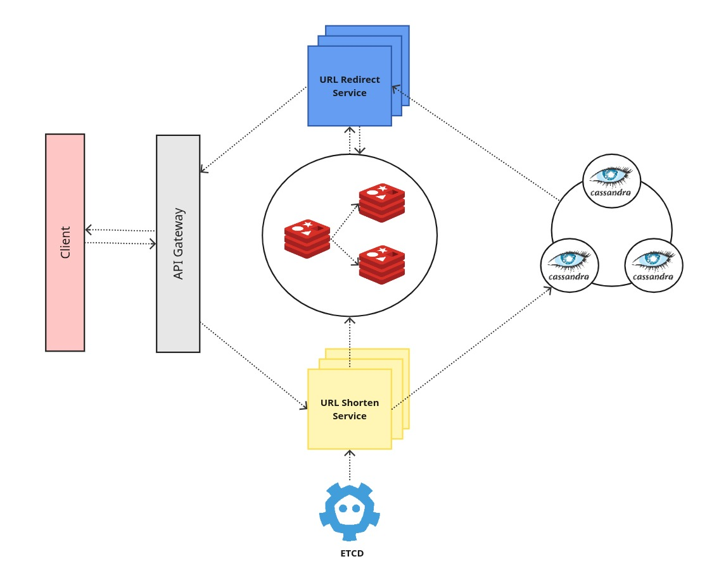

# ChopURL

## Giới thiệu

ChopURL là một dự án nhỏ được tạo ra để thực hành các kiến trúc của môn Kiến trúc phần mềm.

- Frontend: [https://cs-1.vercel.app](https://cs-1.vercel.app)
- Backend: [https://original-cs1-2.onrender.com](https://original-cs1-2.onrender.com)

## Thành viên
- Nguyễn Quang Ninh - 22021166
- Lê Thế Phương Minh - 22028089
- Nguyễn Viết Hoàng - 22028122

## Yêu cầu chức năng (Functional Requirements)

- Tạo URL ngắn
- Chuyển đổi URL ngắn thành URL dài

## Yêu cầu phi chức năng (Non-Functional Requirements)

- **Security**: Tất cả url rút gọn phải được sinh **ngẫu nhiên** và không thể dự đoán được
- **High Availability**: Hệ thống hoạt động liên tục với tỉ lệ downtime nhỏ (SLA > 99.9%)
- **Scalability**: Hệ thống có khả năng mở rộng để chứa được lượng tải cao
- **Consistency**: Hệ thống phải đảm bảo tính duy nhất của url rút gọn được sinh ra, tuy nhiên dữ liệu có thể cập nhật sau tại tất cả các node sau một khoảng thời gian nhất định

## Thiết kế hệ thống

### Thiết kế của URL rút gọn
- Hệ thống sử dụng 7 ký tự base62 (a-z, A-Z, 0-9) để sinh ra url rút gọn
- Dữ liệu đươc lưu dưới dạng int64 và chuyển đổi sang base62 để trả về cho người dùng
  
### Thuật toán sinh URL rút gọn phân tán
- Để tránh việc toàn bộ các node phải **đồng bộ** với nhau mỗi khi 1 node sinh id (hay url rút gọn) mới. Hệ thống chia 62^7 id có thể tạo ra thành **1,000,000 segment** với mỗi segment có 62^7/1,000,000 ≈ 3,000,000 id.
- Mỗi node sẽ được phân phát cho 1 segment và sẽ sinh id (hay url rút gọn) trong phạm vi segment của nó.
- Khi gần hết id trong segment, node sẽ gửi thông báo đến hệ thống **ETCD** để thông báo về việc cần phân phối lại id cho node khác.
- Hệ thống phân tán ETCD sử dụng thuật toán **Fisher-Yates** để sinh 1 segment mới chưa được sử dụng cho phía backend.
- Để đảm bảo tính bảo mật, cả ETCD và phía backend đều cấp phát id **ngẫu nhiên** và không thể dự đoán được.

> Nhờ vậy, hệ thống có thể tạo URL rút gọn mà không cần kiểm tra sự trùng lặp của id tại bất cứ node nào.

### Chiến lược caching   
- Hệ thống sử dụng Redis cho việc caching.
- Ngoài ra, hệ thống sử dụng **2 replication** cho Redis để tăng tốc độ truy xuất dữ liệu và tính sẵn sàng.
- Sử dụng **Redis Sentinel** để quản lý cluster Redis.

### Tách biệt 2 API tạo và chuyển đổi URL
- Do lượng request để đọc url rút gọn lớn hơn rất nhiều so với việc tạo url rút gọn, nên hệ thống tách biệt 2 API này ra thành 2 service khác nhau.
- Hai service sẽ sử dụng chung các node Redis và cluster Cassandra.
- Trong dự án này, nhóm sử dụng 4 instance cho service đọc url rút gọn và 2 instance cho service tạo url rút gọn.

### Cơ sở dữ liệu
- Do hệ thống yêu cầu tính **High Availability**, **Scalability** và không đòi hỏi tính **Consistency** cao, nên nhóm sử dụng **Cassandra** làm cơ sở dữ liệu với 3 node.

### Middleware
- Sử dụng **Nginx** làm middleware để phân phối request đến các service theo thuật toán Round Robin.
- Sử dụng middleware cho CORS và rate limit.

## Kiến trúc hệ thống

## Công nghệ sử dụng
- Frontend: NextJS, TailwindCSS
- Backend: Go, FastHTTP
- Database: Redis, Cassandra
- Caching: Redis, Redis Sentinel
- Distributed: ETCD
- Benchmark: wrk

## Kết quả thực nghiệm
- Các thực nghiệm được thực hiện với 1 triệu request cho mỗi chức năng.

### Tạo URL rút gọn

| Phiên bản | Request/s | Transfer/s | Latency |
| --- | --- | --- | --- |
|NodeJS + Monolithic + Sqlite | 1332 | 0.58MB | 175.43ms |
| Go + Microservices + Cassandra | 9507 | 3.52MB | 43.11ms  |

### Chuyển đổi URL rút gọn

| Phiên bản | Request/s | Transfer/s | Latency |
| --- | --- | --- | --- |
|NodeJS + Monolithic + Sqlite | 4865 | 2.08MB | 28.29ms |
| Go + Microservices + Cassandra | 28556 | 9.04MB | 14.28ms |

